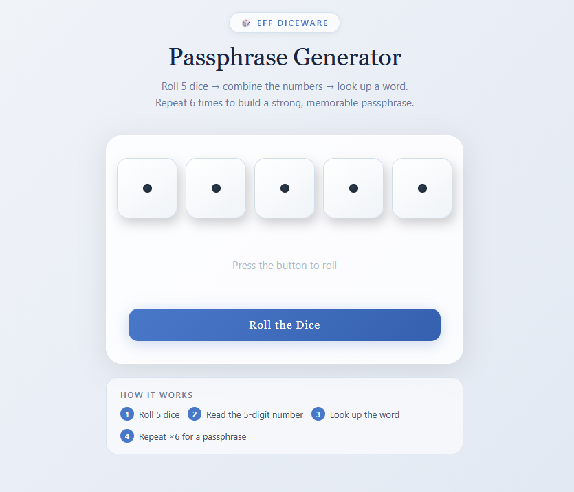

# 🎲 EFF Diceware Passphrase Generator

A clean, offline passphrase generator based on the [EFF Diceware](https://www.eff.org/dice) method. Roll five dice, look up a word, repeat six times — the result is a passphrase with roughly **77 bits of entropy** that's both strong and memorable.

**[Try it live →](https://yourusername.github.io/diceware-generator)** *(update this link after enabling GitHub Pages)*

---

## What is Diceware?

Diceware is a method for generating passphrases using physical or simulated dice. Each roll of 5 dice produces a 5-digit number (e.g. `4-3-4-6-3`) that maps to a word in a standardised wordlist (e.g. `panoramic`). Doing this six times gives you a passphrase like:

> **panoramic nectar precut smith banana handclap**

A six-word passphrase from this 7,776-word list has **2⁷⁷** possible combinations — making it extremely resistant to brute-force attacks, while still being easy to remember.

---

## Features

- 🎲 **Animated dice** that roll and land on random values (1–6)
- 🔑 **5-digit key lookup** mapped directly to the EFF large wordlist (all 7,776 words)
- 📋 **Roll history** showing each of your rolls with its key and word
- 🔐 **Passphrase modal** — after 6 rolls, a dialog reveals your complete passphrase with a copy button
- ↺ **Reset button** to start a fresh passphrase at any time
- ✈️ **Fully offline** — no network requests, no tracking, no ads
- 📦 **Single file** — the entire app is one `.html` file you can download and run locally

---

## How to Use

### Option 1 — Live website (GitHub Pages)
Just click the link at the top of this page. Nothing to install.

### Option 2 — Run locally
1. Download `diceware.html`
2. Double-click it to open in any browser
3. No internet connection needed after downloading

---

## How It Works

1. Click **Roll the Dice** — five dice animate and land on random values
2. The five numbers are combined into a key (e.g. `43463`)
3. That key is looked up in the embedded EFF wordlist → `panoramic`
4. Repeat 6 times
5. After your 6th roll, a modal appears with your complete passphrase
6. Copy it and use it as a master password, disk encryption key, or anywhere a strong passphrase is needed

---

## Security Notes

- **Randomness:** Uses `Math.random()` for simulation, which is suitable for generating passphrases to memorise. For the highest possible security, EFF recommends using real physical dice.
- **No data leaves your device:** The wordlist is embedded in the HTML. Nothing is sent to any server.
- **No storage:** The app does not use cookies, localStorage, or any form of persistent storage.
- **Open source:** You can read every line of code in `diceware.html`.

---

## Wordlist

This project uses the **EFF Large Wordlist** (7,776 words), designed by [Joseph Bonneau](https://www.eff.org/deeplinks/2016/07/new-wordlists-random-passphrases) for the Electronic Frontier Foundation and released under [CC BY 3.0](https://creativecommons.org/licenses/by/3.0/us/).

---

## License

This project is released under the [MIT License](LICENSE). The embedded EFF wordlist is used under [CC BY 3.0](https://creativecommons.org/licenses/by/3.0/us/).
